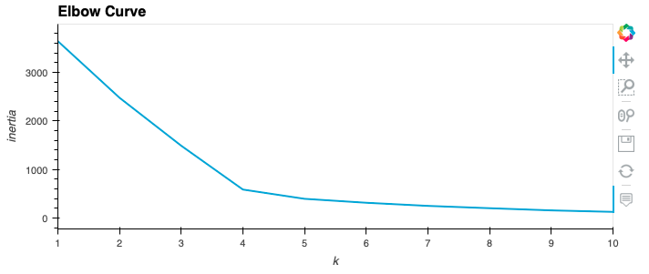

# Cryptocurrencies

## Overview
The purpose of this project is to use unsupervised machine learning to analyze a database of cryptocurrencies and create a report including the traded cryptocurrencies classified by group according to their features.  This classification report could be used by an investment bank to propose a new cryptocurrency investment option to its clients.

The following methods are used for thisanalysis:

~Preprocessing the database

~Reducing the data dimension using Principal Component Analysis

~Clustering cryptocurrencies using K-Means

~Visualizing classification results with 2D and 3D scatter plots

## Results
After the preprocessing and cleaning phase we are left with a total of 532 tradable cryptocurrencies.

Clustering Cryptocurrencies using K-Means - Elbow Curve
We don't know what would be the output of the analysis so we are using unsupervised machine learning to identify clusters of the cryptocurrencies.
We produced the elbow curve below using the K-Means method iterating on k values from 1 to 10

The best k value appears to be 4 so we would conclude on an output of 4 clusters to categorize the crytocurrencies.

### Visualizing Cryptocurrencies Results

### 3D-Scatter plot with clusters.

This 3-D scatter plot was obtained using the PCA algorithm to reduce the crytocurrencies dimensions to three principal components.

### 2D-Scatter plot with clusters.

This 2-D scatter plot was obtained using the PCA algorithm to reduce the crytocurrencies dimensions to two principal components.

Both these scatter plots show the distribution and the four clusters of cryptocurrencies.
We can identify the outliers like the unique cryptocurrency in the class #2.

### Tradable cryptocurrency table.

Most of the cryptocurrencies are part of class #0 and #3.

## Summary
We have identified the classification of 532 cryptocurrencies based on similarities of their features.
Particularities of each group need to be analyzed to determined their performance and potential interest for the investment bank's clients.
